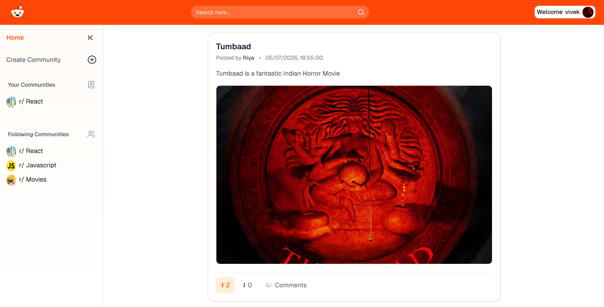
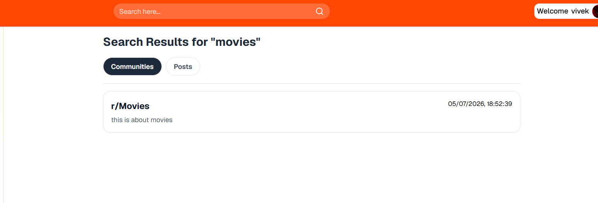
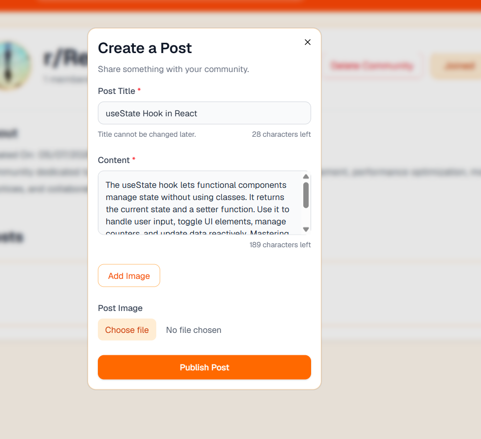
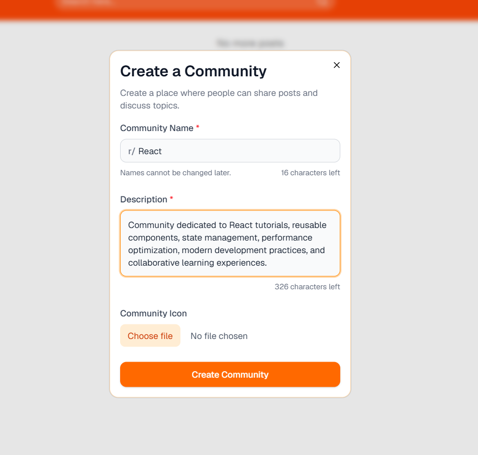
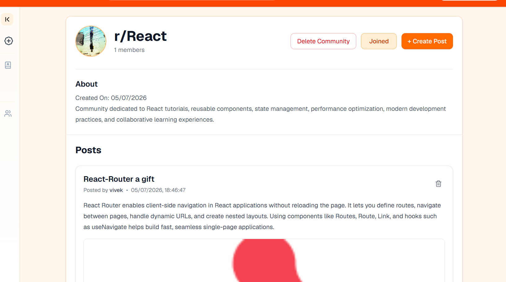
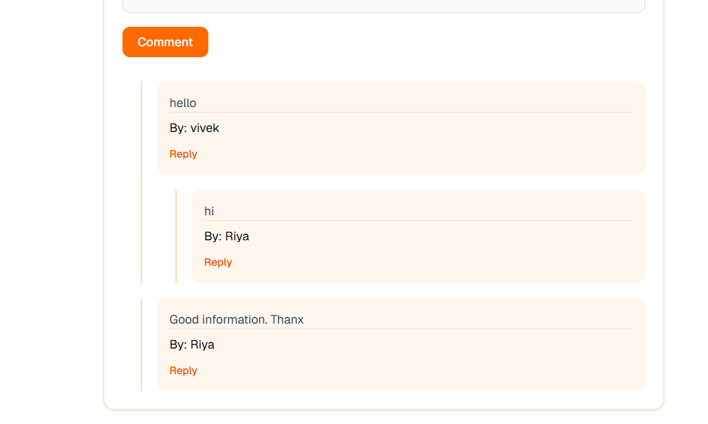

# Reddit Clone (MERN)

A full-stack Reddit-inspired social platform built with the **MERN Stack** where users can create communities, share posts, engage in discussions through nested comments, vote on content, and discover posts with an infinite scrolling feed.

## 🚀 Live Demo

🌐 **Live:** https://reddit-2486.vercel.app/

## 📌 Features

### 👤 Authentication

* User Sign Up & Login
* JWT Authentication
* Protected Routes

### 🏘️ Communities

* Create your own communities
* Join and leave communities
* Follow communities
* View posts from joined communities

### 📝 Posts

* Create text posts
* Upload images with posts
* Delete your own posts
* Infinite scrolling feed
* View posts by community

### 🔥 Voting System

* Upvote posts
* Downvote posts
* Vote count updates instantly
* Prevent duplicate votes

### 💬 Nested Comments

* Add comments to posts
* Reply to comments
* Unlimited nested comment structure

### 🔍 Search

* Search communities
* Search posts

### 👤 User Profile

* Upload profile picture

## 🛠️ Tech Stack

### Frontend

* React
* React Router
* Tailwind CSS
* Axios
* Context API

### Backend

* Node.js
* Express.js
* MongoDB
* Mongoose
* JWT Authentication
* Multer
* Cloudinary

### Deployment

* Vercel (Frontend)
* Render (Backend)
* MongoDB Atlas
* Cloudinary

## 📂 Project Structure

```
client/
├── components/
├── pages/
└── assets/

server/
├── controllers/
├── utils/
├── models/
├── routes/
└── config/
```


## 📸 Screenshots

### 🏠 Home Feed


### 🔍 Search


### 📝 Create Post


### 🏘️ Create Community


### 🌐 Community Page


### 💬 Nested Comments


## 🎥 Demo Video
[▶️ Watch/Download Demo](./Images/app-demo.mp4)

## 🌟 Future Improvements

* Video uploads
* Real-time notifications
* Direct messaging
* Dark mode
* Saved posts
* Trending communities
* Admin moderation tools

## 📚 What I Learned

Building this project helped me gain hands-on experience with:

* Designing REST APIs
* MongoDB schema design
* JWT authentication
* Image uploads using Multer and Cloudinary
* Recursive rendering for nested comments
* Infinite scrolling
* React Context API
* State management
* Responsive UI design
* Deploying full-stack MERN applications

## 🤝 Contributing

Contributions are welcome! Feel free to fork the repository, open issues, or submit pull requests.

## 📄 License

This project is open source and available under the MIT License.
